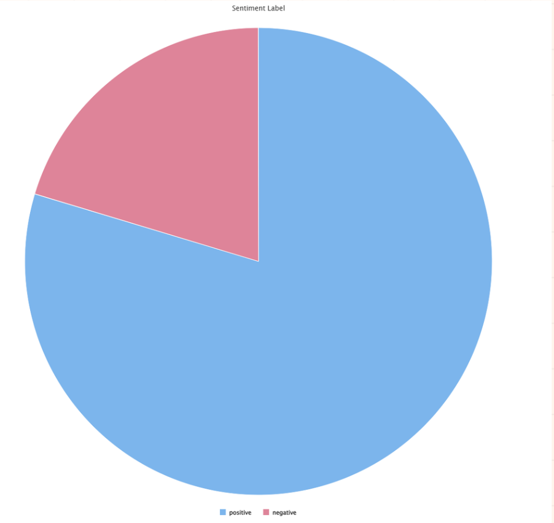
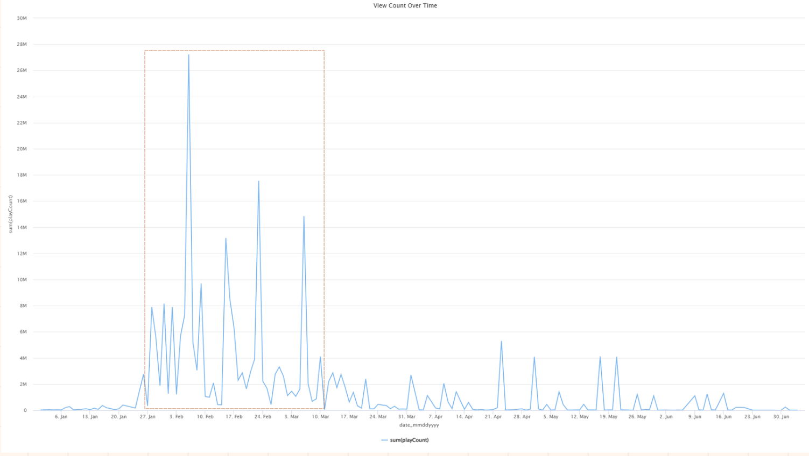
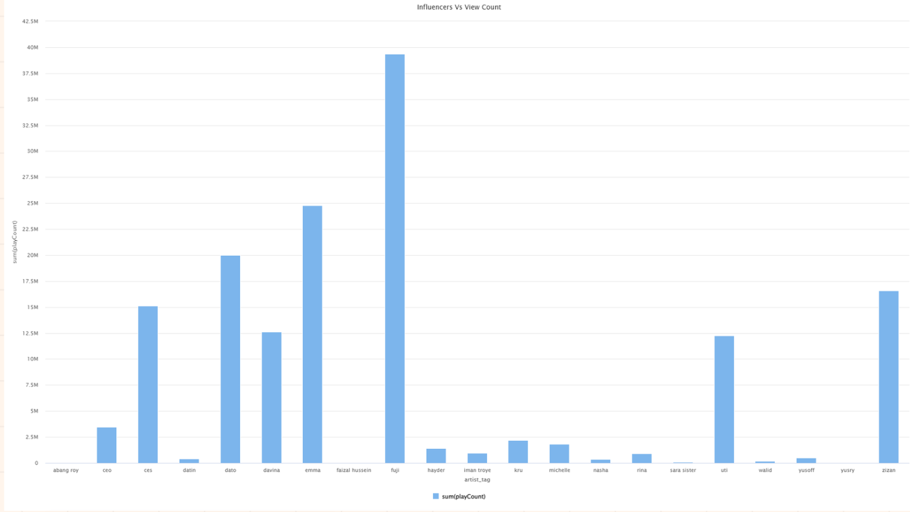
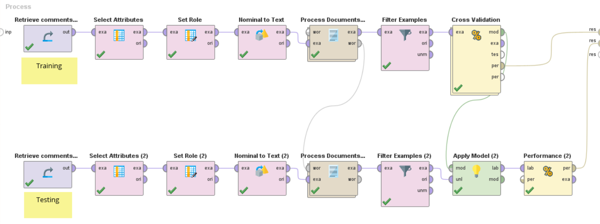
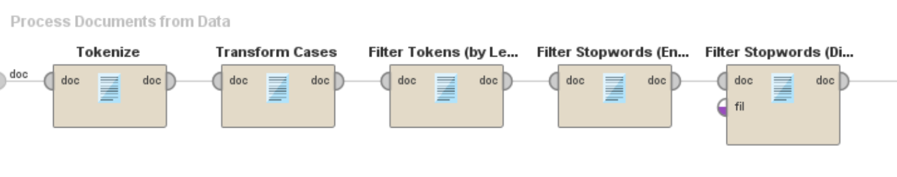

# Hijabistahub TikTok Sentiment Analysis — Engagement Insights & Model Benchmarking

This project analyzes **TikTok comments related to Hijabistahub** to understand **public sentiment** and **engagement patterns**, then benchmarks multiple **text-classification models** (Naive Bayes, SVM, Gradient Boosting). The objective is to convert unstructured social feedback into **actionable insights** that can support content strategy and brand perception monitoring.

---

## What This Project Delivers
- **Sentiment classification** of TikTok comments (positive vs negative)
- **Engagement insights** using view-count trends and influencer comparisons
- **End-to-end ML workflow** (preprocessing → training/testing → evaluation → visualization)

---

## Key Visuals (Project Overview)

<table>
  <tr>
    <td align="center">
      <b>Sentiment Distribution</b> 
      
    </td>
    <td align="center">
      <b>Top Comment Terms</b> 
      
    </td>
  </tr>
  <tr>
    <td align="center">
      <b>View Count Trend Over Time</b> 
      
    </td>
    <td align="center">
      <b>Influencer vs View Count</b> 
      
    </td>
  </tr>
</table>

---

## RapidMiner Pipelines (Reproducible Workflow Evidence)

<table>
  <tr>
    <td align="center">
      <b>Training & Testing Workflow</b> 
      
    </td>
  </tr>
  <tr>
    <td align="center">
      <b>Text Preprocessing Pipeline</b> 
      
    </td>
  </tr>
</table>

---

## Methodology (Summary)
### 1) Data Preparation
- Cleaned noisy social text (symbols, duplicates, inconsistent casing)
- Structured comments into a usable dataset for modeling

### 2) NLP Preprocessing
- Tokenization
- Case transformation
- Token-length filtering
- Stopword removal (English + additional filtering)

### 3) Model Benchmarking
The following models were trained and evaluated with consistent preprocessing:
- **Naive Bayes**
- **SVM**
- **Gradient Boosting**

---

## Tools & Tech Stack
- **RapidMiner Studio** (workflow-based modeling and evaluation)
- **Python (Jupyter Notebooks)** for preprocessing / labeling support
- **CSV datasets** for training/testing inputs

---

## How to Run (Fast Start)
### RapidMiner
1. Open RapidMiner Studio
2. Load the `.rmp` processes
3. Ensure CSV paths are mapped correctly
4. Run the training/testing workflows and visualization process

### Python
1. Open the notebooks (`.ipynb`)
2. Run cells in order to reproduce preprocessing and dataset preparation
